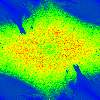

# Double Pendulums and Heatmap

## Description

A simple C++ prgoram designed to find and display stable double pendulum orbits.

## Credits:

All images created in this project are created using the `stbi` libraries.

Major inspo for this project comes form Joe Liang, highly recommend you go check out his stuff. This is ensentially the same thing as what he did however written in C++. All of the code not in the `stbi` files is mine, I intentionally didn't look at his repo. I also got insporoation from many others who have doen similar things to, MIT, and many youtube videos are what inspired me. 